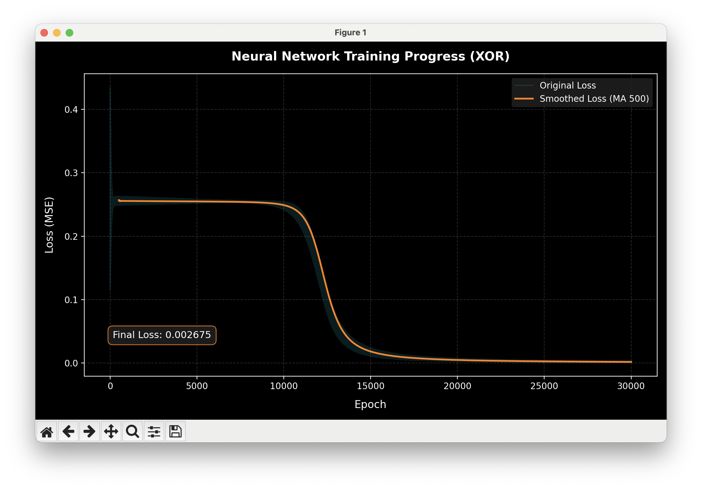
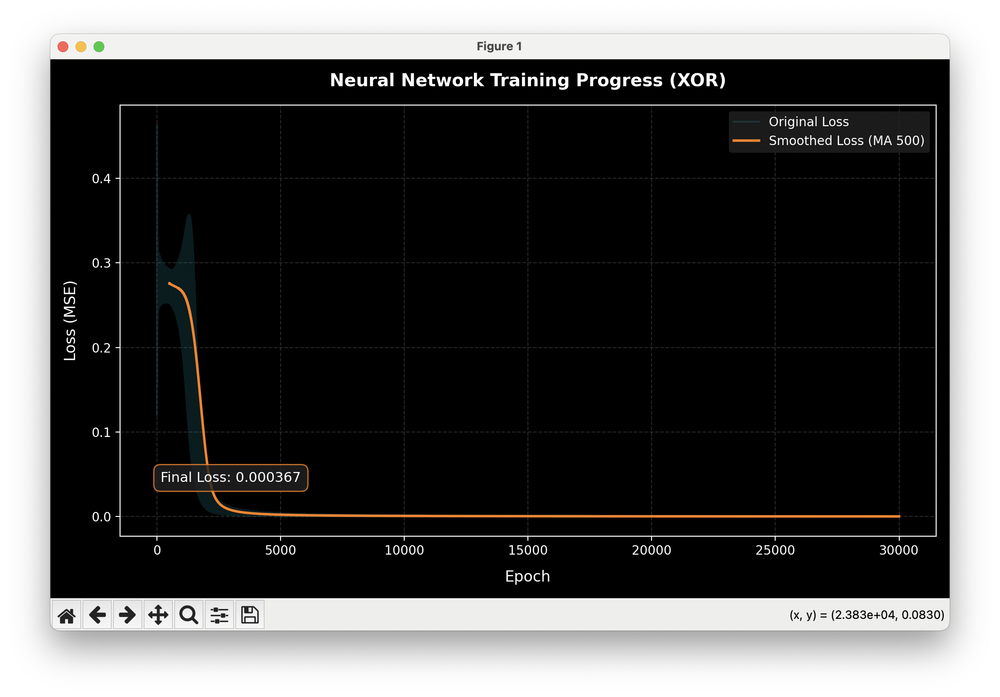
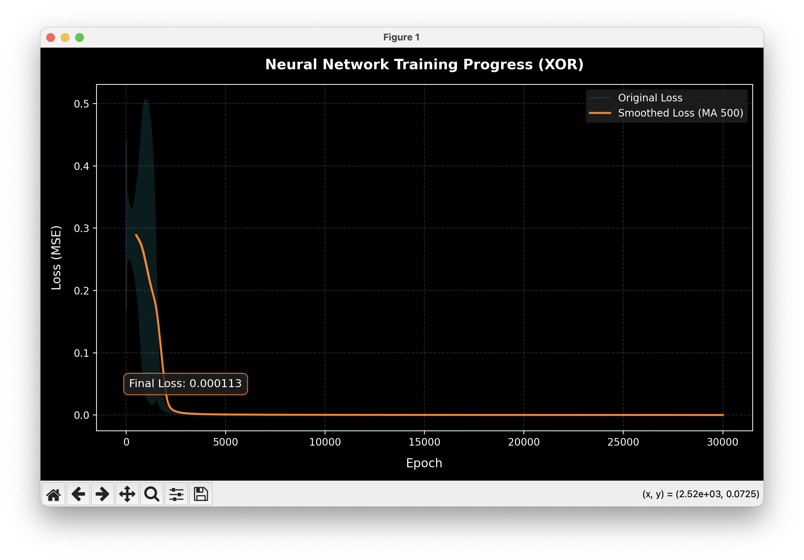
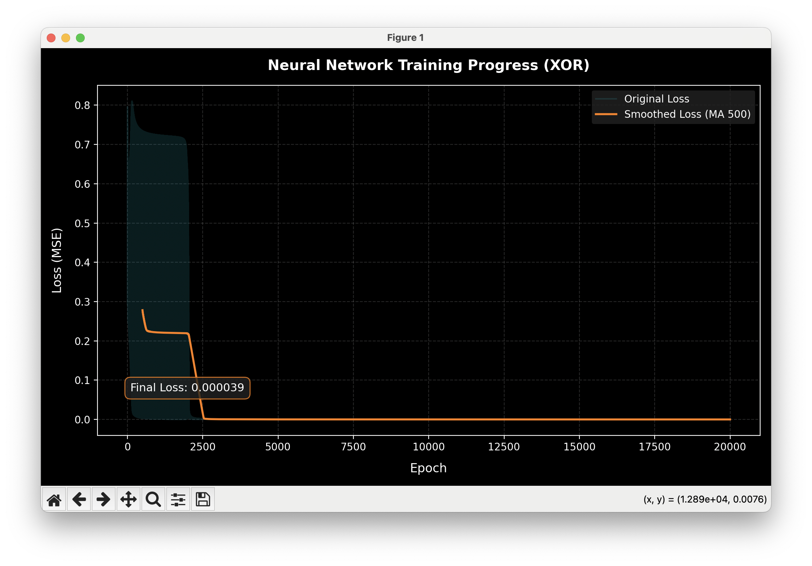
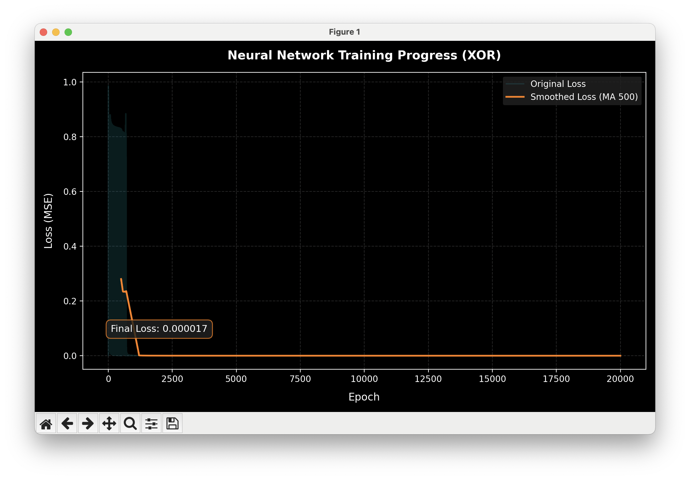
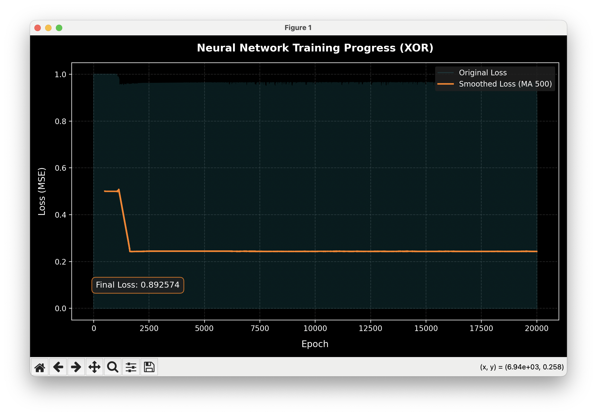

After some experiments and basic research, I found that the best learning rate (a) is usually around 7 to 9. Below are several graphs that illustrate the results.

Larger values can sometimes achieve a lower loss, but they are much less stable. Depending on the random initialization, they may produce either excellent or very poor results. When the learning rate becomes too large (greater than 10), training failures occur much more frequently.

With smaller values (below 10), the network behaves much more consistently. After the initial training phase, failures become rare and the model usually converges to a good solution.

My hypothesis is that larger learning rates have such a strong positive effect because the neural network itself is extremely small. The gradients do not have enough time to grow uncontrollably, allowing the network to reach a good solution much faster. However, if the learning rate becomes too large, the updates become unstable and training quality degrades.

The graphs below show the behavior for different learning rates. The trend is fairly clear from the visual results.

------
# a=0.1

------
# a=0.5

------
# a=0.9

------
# a=5.0

------
# a=10.0

------
# a=20.0

------
# bergog

